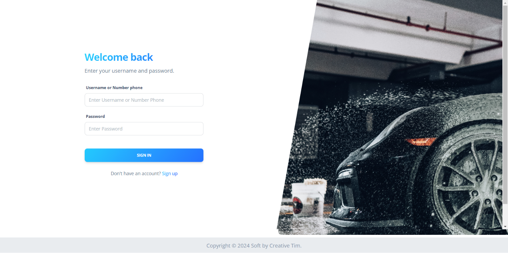

# WEBSITE CUCI KENDARAAN SEDERHANA

Ini adalah website sederhana yang dirancang untuk mengelola usaha cuci kendaraan menggunakan framework CodeIgniter 3. Website ini dirancang dengan dua role utama: admin dan employee. Database yang digunakan untuk menyimpan data website ini dapat ditemukan di folder database. Di dalam folder tersebut, Anda akan menemukan struktur tabel dan skema yang diperlukan untuk menjalankan website ini dengan lancar.

## Screenshots

### Login

### Menu Admin

### Menu Employee

